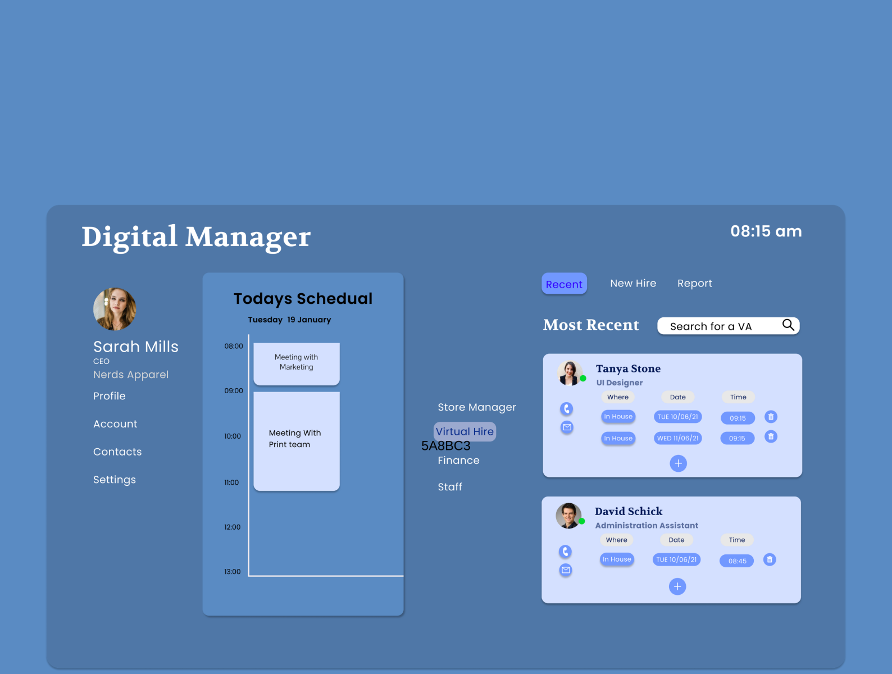

![banner]

# Hello World :earth_asia:

### I'm Anthony.

**Front-End Web Developer** | **UI /UX Designer**

---

### **let's Connect:**

You can find me on [![Twitter][1.1]][1], or on [![LinkedIn][2.2]][2].

---

 A few of my designs from [![Dribbble][3.3]][3] 

 [![Digital-Manager][4.1]][4]

 [![Web-Design-Studio][4.2]][5]

<!--  -->
 
🔭 I’m currently completing a web development bootcamp with CoderAcademy

<!--  -->

### Current Technologies
  **RUBY ON RAILS**  **<>**  **HTML**  **<>**  **SCSS**  **<>**  **JS**
  

---

<!-- Icons -->

[1.1]: https://raw.githubusercontent.com/MrAjMann/MrAjMann/master/img//twitter.png (twitter)

[2.2]: https://raw.githubusercontent.com/MrAjMann/MrAjMann/master/img/LinkedIn.png (LinkedIn)

[3.3]: https://raw.githubusercontent.com/MrAjMann/MrAjMann/master/img/DribbbleBanner.png (Dribbble)

[4.1]: https://raw.githubusercontent.com/MrAjMann/MrAjMann/master/img/DribbbleDesigns/DigitalManager.png(Digital-Manager)

[4.2]: https://raw.githubusercontent.com/MrAjMann/MrAjMann/master/img/DribbbleDesigns/Web-Design-Studio-Landing-Page.png(Web-Design-Studio-Landing-Page)
<!-- Links to your social media accounts -->

[1]: https://twitter.com/mycodingjourne3

[2]: https://www.linkedin.com/in/anthonyjmann87/

[3]: https://www.dribbble.com/MyCodingJourne3

[4]:https://dribbble.com/shots/14712214-Digital-Manager

[5]: https://dribbble.com/shots/14670371-Website-Design-Studio

[banner]: https://raw.githubusercontent.com/MrAjMann/MrAjMann/master/img/GitHub-Background.png

<!--
**MrAjMann/MrAjMann** is a ✨ _special_ ✨ repository because its `README.md` (this file) appears on your GitHub profile.

Here are some ideas to get you started:

- 🔭 I’m currently working on ...
- 🌱 I’m currently learning ...
- 👯 I’m looking to collaborate on ...
- 🤔 I’m looking for help with ...
- 💬 Ask me about ...
- 📫 How to reach me: ...
- 😄 Pronouns: ...
- ⚡ Fun fact: ...
-->

